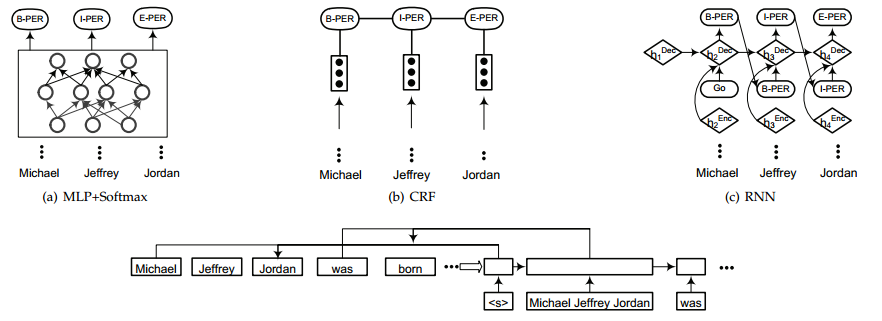

# 1 INTRODUCTION  
Named Entity Recognition (NER) aims to recognize mentions of rigid designators from text belonging to predefined semantic types such as person, location, organization etc.  
As to the techniques applied in NER, there are four main streams: 
1) Rule-based approaches, which do not need annotated data as they rely on hand-crafted rules;
2) Unsupervised learning approaches, which rely on unsupervised algorithms without hand-labeled training examples; 
3) Feature-based supervised learning approaches, which rely on supervised learning algorithms with careful feature engineering; 
4) Deep-learning based approaches, which automatically discover representations needed for the classification and/or detection from raw input in an end-toend manner. 
   
# 2 BACKGROUND
## 2.4 Traditional Approaches to NER
### 2.4.1 Rule-based Approaches  
Rule-based NER systems rely on hand-crafted rules. Rules can be designed based on domain-specific gazetteers, and syntactic-lexical patterns. These systems are mainly based on hand-crafted semantic and syntactic rules to recognize entities. Rule-based systems work very well when lexicon is exhaustive. Due to domain-specific rules and incomplete dictionaries, high precision and low recall are often observed from such systems, and the systems cannot be transferred to other domains.

### 2.4.2 Unsupervised Learning Approaches
A typical approach of unsupervised learning is clustering. Clustering-based NER systems extract named entities from the clustered groups based on context similarity. The key idea is that lexical resources, lexical patterns, and statistics computed on a large corpus can be used to infer mentions of named entities. 

### 2.4.3 Feature-based Supervised Learning Approaches
Applying supervised learning, NER is cast to a multi-class classification or sequence labeling task. Given annotated data samples, features are carefully designed to represent each training example. Machine learning algorithms are then utilized to learn a model to recognize similar patterns from unseen data.
Feature engineering is critical in supervised NER systems. Feature vector representation is an abstraction over text where a word is represented by one or many Boolean, numeric, or nominal values. Word-level features (e.g., case, morphology, and part-of-speech tag), list lookup features (e.g., Wikipedia gazetteer and DBpedia gazetteer), and document and corpus features (e.g., local syntax and multiple occurrences) have been widely used in various supervised NER systems.
Based on these features, many machine learning algorithms have been applied in supervised NER, including Hidden Markov Models (HMM), Decision Trees, Maximum Entropy Models [71], Support Vector Machines (SVM), and Conditional Random Fields (CRF).

# 3 DEEP LEARNING TECHNIQUES FOR NER
## 3.1 Why Deep Learning for NER?
Deep learning is a field of machine learning that is composed of multiple processing layers to learn representations of data with multiple levels of abstraction. The typical layers are artificial neural networks which consists of the forward pass and backward pass. The forward pass computes a weighted sum of their inputs from the previous layer and pass the result through a non-linear function. The backward pass is to compute the gradient of an objective function with respect to the weights of a multilayer stack of modules via the chain rule of derivatives. The key advantage of deep learning is the capability of representation learning and the semantic composition empowered by both the vector representation and neural processing. This allows a machine to be fed with raw data and to automatically discover latent representations and processing needed for classification or detection.
There are three core strengths of applying deep learning techniques to NER. First, NER benefits from the non-linear transformation, which generates non-linear mappings from input to output. Compared with linear models (e.g., loglinear HMM and linear chain CRF), DL-based models are able to learn complex and intricate features from data via non-linear activation functions. Second, deep learning saves significant effort on designing NER features. The traditional

## 3.2 Distributed Representations for Input
### 3.2.1 Word-level Representation
Some studies employed word-level representation, which is typically pre-trained over large collections of text through unsupervised algorithms such as continuous bagof-words (CBOW) and continuous skip-gram models. Recent studies, have shown the importance of such pre-trained word embeddings. Using as the input, the pre-trained word embeddings can be either fixed or further fine-tuned during NER model training. Commonly used word embeddings include Google Word2Vec, Stanford GloVe, Facebook fastText and SENNA.

### 3.2.2 Character-level Representation
Instead of only considering word-level representations as the basic input, several studies, incorporated character-based word representations learned from an endto-end neural model. Character-level representation has been found useful for exploiting explicit   sub-word-level information such as prefix and suffix. Another advantage of character-level representation is that it naturally handles out-of-vocabulary  . Thus character-based model is able to infer representations for unseen words and share information of morpheme-level regularities. 

### 3.2.3 Hybrid Representation
Besides word-level and character-level representations, some studies also incorporate additional information (e.g., gazetteers, lexical similarity, linguistic dependency and visual features) into the final representations of words, before feeding into context encoding layers. In other words, the DL-based representation is combined with feature-based approach in a hybrid manner. Adding additional information may lead to improvements in NER performance,  with the price of hurting generality of these systems. 

## 3.3 Context Encoder Architectures
Here, we now review widely-used context encoder architectures: convolutional neural networks, recurrent neural networks, recursive neural networks, and deep transformer.

## 3.4 Tag Decoder Architectures
Tag decoder is the final stage in a NER model. It takes context-dependent representations as input and produce a sequence of tags corresponding to the input sequence.

Four architectures of tag decoders: MLP + softmax layer, conditional random fields (CRFs), recurrent neural networks, and pointer networks.

# 4 APPLIED DEEP LEARNING FOR NER
## 4.1 Deep Multi-task Learning for NER
Multi-task learning is an approach that learns a group of related tasks together. By considering the relation between different tasks, multi-task learning algorithms are expected to achieve better results than the ones that learn each task individually.
Other than considering NER together with other sequence labeling tasks, multi-task learning framework can be applied for joint extraction of entities and relations, or to model NER as two related subtasks: entity segmentation and entity category prediction. In biomedical domain, because of the differences in different datasets, NER on each dataset is considered as a task in a multi-task setting. A main assumption here is that the different datasets share the same character- and word-level information. Then multi-task learning is applied to make more efficient use of the data and to encourage the models to learn more generalized representations.

## 4.2 Deep Transfer Learning for NER
Transfer learning aims to perform a machine learning task on a target domain by taking advantage of knowledge learned from a source domain. In NLP, transfer learning is also known as domain adaptation. On NER tasks, the traditional approach is through bootstrapping algorithms. Recently, a few approaches, have been proposed for low-resource and acrossdomain NER using deep neural networks.

## 4.3 Deep Active Learning for NER
The key idea behind active learning is that a machine learning algorithm can perform better with substantially less data from training, if it is allowed to choose the data from which it learns. Deep learning typically requires a large amount of training data which is costly to obtain. Thus, combining deep learning with active learning is expected to reduce data annotation effort.
Training with active learning proceeds in multiple rounds. However, traditional active learning schemes are expensive for deep learning because after each round they require complete retraining of the classifier with newly annotated samples.

## 4.4 Deep Reinforcement Learning for NER
Reinforcement learning (RL) is a branch of machine learning inspired by behaviorist psychology, which is concerned with how software agents take actions in an environment so as to maximize some cumulative rewards. The idea is that an agent will learn from the environment by interacting with it and receiving rewards for performing actions. Specifically, the RL problem can be formulated as follows: the environment is modeled as a stochastic finite state machine with inputs (actions from agent) and outputs (observations and rewards to the agent). It consists of three key components: (i) state transition function, (ii) observation (i.e., output) function, and (iii) reward function.
The agent is also modeled as a stochastic finite state machine with inputs (observations/rewards from the environment) and outputs (actions to the environment). It consists of two components: (i) state transition function, and (ii) policy/output function. The ultimate goal of an agent is to learn a good state-update function and policy by attempting to maximize the cumulative rewards.

## 4.6 Neural Attention for NER
The attention mechanism is loosely based on the visual attention mechanism found in human. For example, people usually focus on a certain region of an image with “high resolution” while perceiving the surrounding region with “low resolution”. Neural attention mechanism allows neural networks have the ability to focus on a subset of its inputs. By applying attention mechanism, a NER model could capture the most informative elements in the inputs.
