# 1 INTRODUCTION  

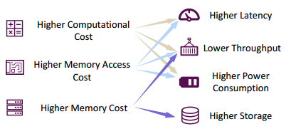
The challenges of LLM deployment.

# 2 PRELIMINARIES  
## 2.1 Transformer-Style LLMs 
A Transformer block consists of a MultiHead Self-Attention (MHSA) block, a Feed Forward Network (FFN), and a LayerNorm (LN) operation. For each block, it receives the output features of the previous one as the input, and passes the features through each submodule to obtain the output. Specially, before the first block, a tokenizer is used to convert the original input sentence into a sequence of tokens, and a following embedding layer serves to convert the tokens into the input features. Then, the additional position embeddings are added into the input features to encode the sequential order of each input token.
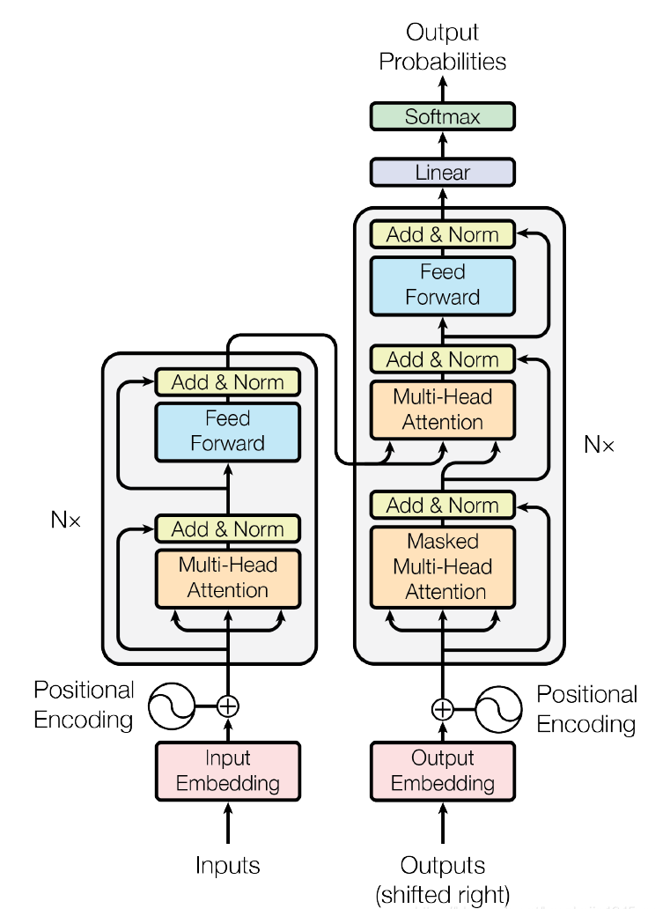

## 2.2 Inference Process of LLMs  
The most popular LLMs, i.e., decoder-only LLMs, often adopt the auto-regressive method to generate the output sentence. Specifically, the auto-regressive method generates the tokens one by one. In each generation step, the LLM takes as input the whole token sequences, including the input tokens and previously generated tokens, and generates the next token. With the increase in sequence length, the time cost of the generation process grows rapidly. To address this challenge, a crucial technique, namely key-value (KV) cache, has been introduced to expedite the generation process. The KV cache technique involves storing and reusing previous key (K) and value (V) pairs within the Multi-Head Self-Attention (MHSA) block.   
• Prefilling Stage: The LLM calculates and stores the KV cache of the initial input tokens, and generates the first output token.
• Decoding Stage: The LLM generates the output tokens one by one with the KV cache, and then updates it with the key (K) and value (V) pairs of the newly generated token.

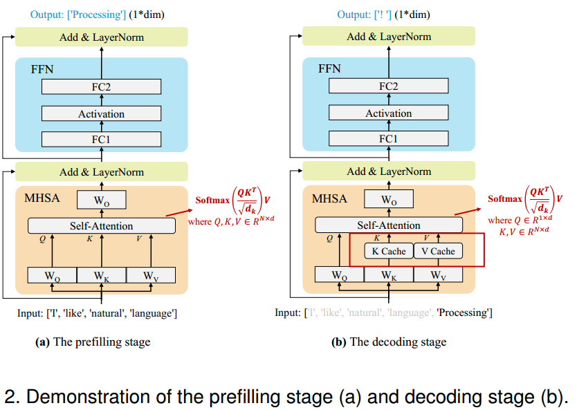

## 2.3 Efficiency Analysis
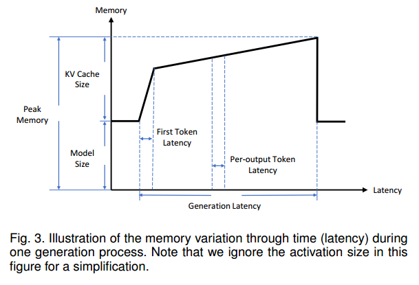  
Three root causes of inefficiency in the LLM inference process, focusing on the above three key factors:
• Model Size: Mainstream LLMs typically incorporate billions or even trillions of parameters. For instance, the LLaMA-70B model comprises 70 billion parameters, while the GPT-3 model scales up to 175 billion parameters. This considerable model size contributes significantly to the elevated computational cost, memory access cost, and memory usage during the LLM inference process.
• Attention Operation: Self-attention operation exhibits quadratic computational complexity in the input length. Consequently, as the input length increases, the computational cost, memory access cost, and memory usage of the attention operation escalate rapidly.
• Decoding Approach: The auto-regressive decoding approach generates the tokens one by one. In each decoding step, all the model weights are loaded from the offchip HBM (High Bandwidth Memory) to the GPU chip, leading to a large memory access cost. In addition, the size of KV cache increases with the growth in the input length, potentially leading to fragmented memory and irregular memory access patterns.
# 3 TAXONOMY
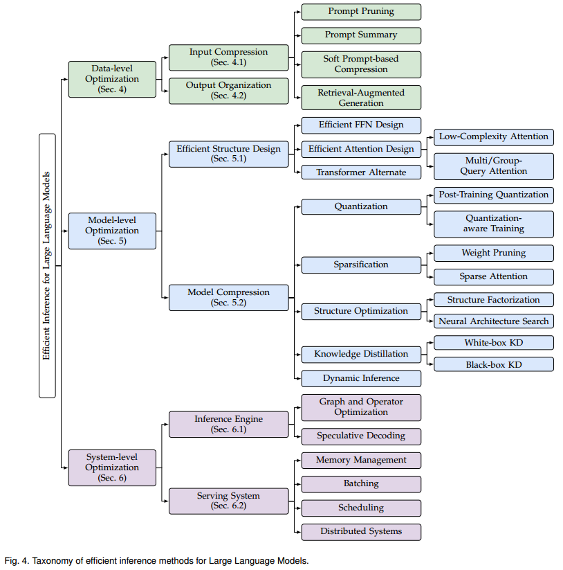  
• Data-level Optimization refers to improving the efficiency via optimizing the input prompts (i.e., input compression) or better organizing the output content (i.e., output organization). This line of optimization typically does not change the original model, thus is free of costly model training cost (note that a small amount of training for auxiliary models might be required, but this cost can be ignored compared with the training cost for original LLMs).
• Model-level Optimization refers to designing an efficient model structure (i.e., efficient structure design) or compressing the pre-trained models (i.e., model compression) in the inference process to improve its efficiency. This line of optimization (1) often requires costly pre-training or a smaller amount of fine-tuning cost to retain or recover the model ability, and (2) is typically lossy in the model performance.
• System-level Optimization refers to optimizing the inference engine or the serving system. This line of optimization (1) does not involve the costly model training, and (2) is typically lossless in model performance.
# 4 DATA-LEVEL OPTIMIZATION  
## 4.1 Input Compression
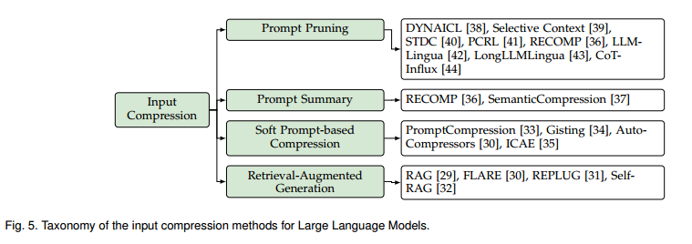
### 4.1.1 Prompt Pruning
The core idea behind the prompt pruning is to remove unimportant tokens, sentences, or documents online from each input prompt based on predefined or learnable importance indicators. 

### 4.1.2 Prompt Summary
The core idea of prompt summary is to condense the original prompt into a shorter summary while preserving similar semantic information. These techniques also serve as online compression methods for prompts. In contrast to the aforementioned prompt pruning techniques that preserve the unpruned tokens unchanged, this line of methods converts the entire prompt into its summation. 

### 4.1.3 Soft Prompt-based Compression
The core idea of this kind of compression techniques is to design a soft prompt, significantly shorter than the original prompt , for use as input to LLMs. The soft prompt is defined as a sequence of learnable continuous tokens. Some techniques adopt offline compression for the fixed prefix prompt (e.g., system prompt, task-specific prompt).

### 4.1.4 Retrieval-Augmented Generation
Retrieval-Augmented Generation (RAG) aims to improve the quality of LLMs’ responses by incorporating external knowledge sources. RAG can be also viewed as a technique to improve the inference efficiency when handling a large amount of data. Instead of merging all information into an excessively long prompt, RAG only adds relevant retrieved information to the original prompt, ensuring that the model receives necessary information while reducing prompt length significantly. 

## 4.2 Output Organization
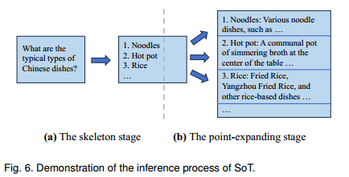
Skeleton-of-Thought (SoT) is pioneering in this direction. The core idea behind SoT is to leverage the emerging ability of LLMs to plan the output content’s structure. Specifically, SoT consists of two main phases. In the
first phase (i.e., skeleton phase), SoT instructs the LLM to generate a concise skeleton of the answer using a predefined ”skeleton prompt.” Then, in the second phase (i.e., point-expanding phase), SoT instructs the LLM to expand each point in the skeleton simultaneously using a ”point-expanding prompt,” and then concatenates these expansions to form the final answer.

# 5 MODEL-LEVEL OPTIMIZATION
## 5.1 Efficient Structure Design
• The FFN contributes a substantial portion of the model parameters in Transformer-based LLMs, resulting in significant memory access cost and memory usage, particularly during the decoding stage. For instance, the FFN module accounts for 63.01% of the parameters in the LLaMA-7B model and 71.69% in the LLaMA-70B model.
• The attention operation demonstrates quadratic complexity in the input length, leading to substantial computational cost and memory usage, especially when dealing with longer input contexts.
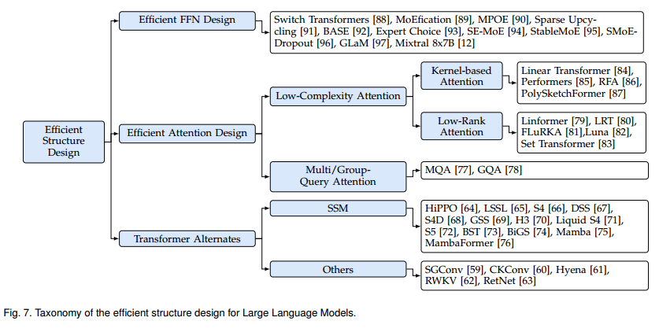
### 5.1.1 Efficient FFN Design
In this field, many studies concentrate on integrating the Mixture-of-Experts (MoE) technique into LLMs to enhance their performance while maintaining the computational cost. The core idea of MoE is to dynamically allocate varying computational budgets to different input tokens. In MoE-based Transformers, multiple parallel Feed Forward Networks (FFNs), namely experts, are utilized alongside a trainable routing module. During inference, the model selectively activates specific experts for each token controlled by the routing module.

### 5.1.2 Efficient Attention Design
Multi-Query Attention. Multi-query attention (MQA) optimizes the attention operation by sharing the key (K) and value (V) cache across different attention heads. This strategy effectively reduces both memory access cost and memory usage during inference, contributing to improved efficiency in Transformer models.
Low-Complexity Attention. Low-complexity attention methods aim to design new mechanisms that reduce the computational complexity of each attention head. To simplify the discussion, we assume that the dimensions of the Q (query), K (key), and V (value) matrices are identical. To address the inefficiency issue, kernel-based attention and low-rank attention (employs compression on the token dimensions (i.e., n) of the K and V matrices to a smaller, fixed length (i.e., k) before performing the attention computation) methods are proposed to reduce the complexity to O(n).

## 5.2 Model Compression
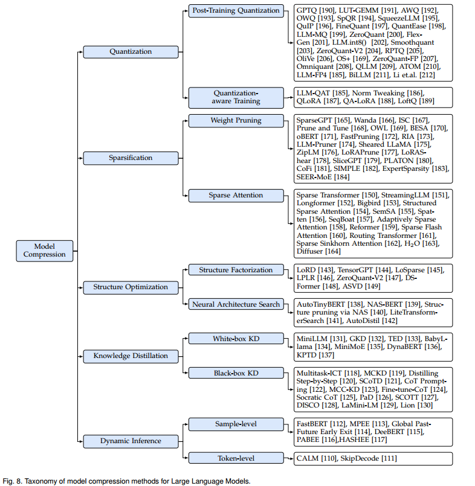

### 5.2.1 Quantization
Quantization is a widely employed technique that reduces the computational and memory cost of LLMs by converting the models’ weights and activations from high bit-width to low bit-width representations. Specifically, many methods involve quantizing FP16 tensors into low-bit integer tensors.

### 5.2.2 Sparsification
Sparsification is a compression technique that increases the proportion of zero-valued elements in data structures such as model parameters or activations. This method aims to decrease computational complexity and memory usage by efficiently ignoring zero elements during computation. In the context of LLMs, sparsification is commonly applied to weight parameters and attention activations. It leads to the development of weight pruning strategies and sparse attention mechanisms.
Weight Pruning. Weight pruning systematically removes
less critical weights and structures from models, aiming to reduce computational and memory cost during both prefilling stages and decoding stages without significantly compromising performance. This sparsification approach is categorized into two main types: unstructured pruning and structured pruning. 
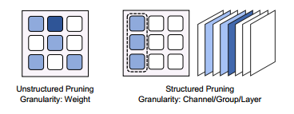
The practical benefits of unstructured pruning in terms of hardware efficiency and computational speedup may be limited.

Sparse Attention. Sparse attention techniques in MultiHead Self-Attention (MHSA) components of transformer models strategically omit certain attention calculations to enhance computational efficiency of the attention operation mainly in the prefilling stage. These mechanisms diverge into static and dynamic categories based on their reliance on specific input data.
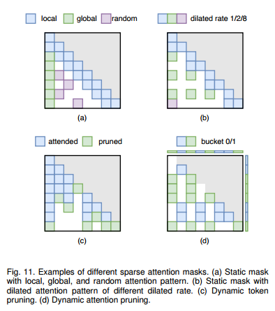

### 5.2.3 Structure Optimization
The objective of structure optimization is to refine model architecture or structure with the goal of enhancing the balance between model efficiency and performance. Within this field of research, two prominent techniques stand out: Neural Architecture Search (NAS) and Low Rank Factorization (LRF).

### 5.2.4 Knowledge Distillation
Knowledge Distillation (KD) is a well-established technique for model compression, wherein knowledge from large models (referred to as teacher models) is transferred to smaller models (referred to as student models). In the context of LLMs, KD involves using the original LLMs as teacher models to distill smaller LMs. Numerous studies have focused on effectively transferring various abilities of LLMs to smaller models. In this domain, methods can be categorized into two main types: white-box KD and blackbox KD.
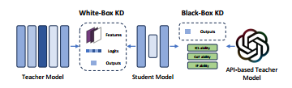
White-box KD. White-box KD refers to distillation methods that leverage access to the structure and parameters of the teacher models. This approach enables KD to effectively utilize the intermediate features and output logits of the teacher models for enhanced performance of the student models.
Black-box KD. Black-box KD refers to the knowledge distillation methods in which the structure and parameters of teacher models are not available. Typically, black-box KD only uses the final results obtained by the teacher models to distill the student models. In the field of LLMs, blackbox KD mainly guides the student models to learn LLMs’ generalization ability and emergent ability, including InContext Learning (ICL) ability, Chain-of-Thought (CoT) reasoning ability and Instruction Following (IF) ability.

### 5.2.5 Dynamic Inference
Dynamic inference involves the adaptive selection of model sub-structures during the inference process, conditioned on input data. 
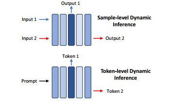
Sample-level. Sample-level early exiting techniques focus on determining the optimal size and structure of Language Models (LLMs) for individual input samples. A common approach is to augment LLMs with additional modules after each layer, leveraging these modules to decide whether to terminate inference at a specific layer.
Token-level. In the decoding stage of LLM inference, where tokens are generated sequentially, token-level early exiting techniques aim to optimize the size and structure of LLMs for each output token. 

# 6 SYSTEM-LEVEL OPTIMIZATION
The system-level optimization for LLM inference primarily involves enhancing the model forward pass. Considering the computational graph of a LLM, there exist multiple operators, with attention and linear operators dominating most of the runtime. As mentioned in Sec. 2.3, systemlevel optimization primarily considers the distinctive characteristics of the attention operator and the decoding approach within LLM. In particular, to address the specific issues related to the decoding approach of LLMs, the linear operator requires special tiling designs, and speculative decoding methods are proposed to improve the utilization. Furthermore, in the context of online serving, requests come from multiple users. Therefore, beyond the optimizations discussed earlier, online serving faces challenges related to memory, batching and scheduling arising from asynchronous requests.

## 6.1 Inference Engine
The optimizations for inference engines are dedicated to accelerate the model forward process. Main operators and the computational graph in LLM inference are highly optimized. Besides, speculative decoding technique is proposed to accelerate the inference speed without performance degradation.

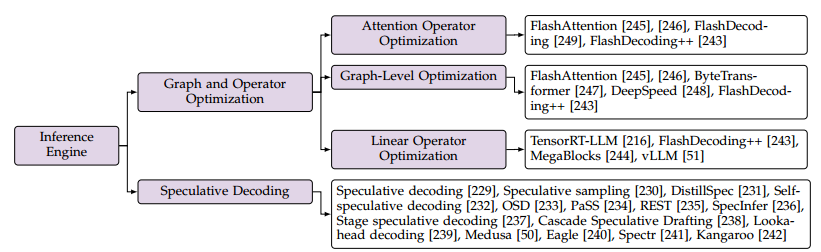

## 6.2 Serving System
The optimizations for serving systems are dedicated to improve the efficiency in handling asynchronous requests. The memory management is optimized to hold more requests, and efficient batching and scheduling strategies are integrated to improve the system throughput. Besides,optimizations specific to distributed systems are proposed to exploit distributed computational resources.

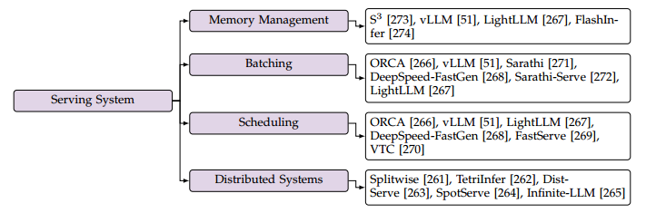

# 7 DISCUSSIONS OF KEY APPLICATION SCENARIOS
Agent and Multi-Model Framework. 
Long-Context LLMs.
Edge Scenario Deployment. 
Security-Efficiency Synergy. 