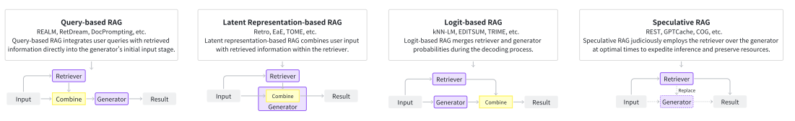

# 1 INTRODUCTION
## 1.1 Backgroud
The word “AIGC” emphasizes that the contents are produced by advanced generative models other than human beings or rule-based approaches. These generative models have achieved remarkable performance due to the utilization of novel model algorithms, explosive scale of foundation models, and massive high-quality datasets. Specifically, sequence-tosequence tasks have transitioned from utilizing Long ShortTerm Memory (LSTM) networks to Transformer-based models, and image-generation tasks have shifted from Generative Adversarial Networks (GANs) to Latent Diffusion Models (LDMs) as well. Notably, the architecture of foundation models, initially constituted by millions of parameters, has now grown to billions or even trillions of parameters. These advancements are further bolstered by the availability of rich, high-quality datasets, which provide ample training samples to fully optimize model parameters.

# 2 PRELIMINARY
## 2.1 A. Overview
As shown in Fig. 1, the entire RAG system consists of two core modules: the retriever and the generator where the retriever searches for relevant information from the data store and the generator produces the required contents. The RAG process unfolds as follows: (i) the retriever initially receives the input query and searches for relevant information; (ii) then, the original query and the retrieval results are fed into the generator through a specific augmentation methodology; (iii) finally, the generator produces the desired outcomes.

## 2.2 Generator
The remarkable performance of generative AI across diverse tasks has ushered in the era of AIGC. The generation module plays a crucial role within the RAG system. Different generative models are applied for different scenarios, such as transformer models for text-to-text tasks, VisualGPT for image-to-text tasks, Stable Diffusion for text-toimage tasks, Codex for text-to-code tasks, etc. Here we introduce 4 typical generators that are frequently used in RAG:
transformer model, LSTM, diffusion model, and GAN.

## 2.3 Retriever
Retrieval is to identify and obtain relevant information given an information need. Specifically, let’s consider information resources that can be conceptualized as a key-value store, where each key corresponds to a value (keys and values can be identical). Given a query, the objective is to search for the top-k most similar keys using a similarity function, and obtain the paired values. Based on different similarity functions, existing retrieval methods can be categorized into sparse retrieval, dense retrieval, and others. In widely used sparse and dense retrieval, the entire process can be divided into two distinct phases: (i) each object is first encoded into a specific representation; and then (ii) an index is constructed
to organize the data source for efficient search.

# 3 METHODOLOGIES
## 3.1 RAG Foundations
Based on how the retriever augments the generator, we categorize RAG foundations into 4 classes.

1) Query-based RAG: Stemming from the idea of prompt augmentation, query-based RAG seamlessly integrates the user’s query with insights from retrieved information, feeding it directly into the initial stage of the generator’s input. This method is prevalent in RAG applications. Post-retrieval, the obtained content is merged with the user’s original query to form a composite input, which is then processed by the generator to create a response. Query-based RAG is widely employed across various modalities.
   
2) Latent Representation-based RAG: In latent representation-based RAG framework, retrieved objects are incorporated into generative models as latent representations. This enhances the model’s comprehension abilities and improves the quality of the generated content.

3) Logit-based RAG: In logit-based RAG, generative models integrate retrieval information through logits during the decoding process. Typically, the logits are combined through simple summation or models to compute the probabilities for step-wise generation.

4) Speculative RAG: Speculative RAG seeks opportunities to use retrieval instead of pure generation, aiming to save resources and accelerate response speed. 

# 3.1 RAG Enhancements
In this section, we introduce methods which enhance the performance of a constructed RAG system. We categorize existing methods into 5 groups based on their enhancement targets: input, retriever, generator, result, and the entire pipeline.

1) Input Enhancement: The input, initially fed into the retriever, significantly impacts the final outcome of the retrieval stage. In this section, we introduce two methods for input enhancement: query transformation and data augmentation.
Query Transformation: Query transformation can enhance the result of retrieval by modifying the input query.
Data Augmentation: Data augmentation improves data before retrieval, including techniques such as removing irrelevant information, eliminating ambiguity, updating outdated documents, synthesize new data, etc.

2) Retriever Enhancement: In RAG systems, the quality
of retrieved content determines the information fed into the generators. Lower content quality increases the risk of model hallucinations or other degradation. In this section, we introduce efficient ways to enhance retrieval effectiveness.
Recursive Retrieval: Recursive retrieval is to perform multiple searches to retrieve richer and higher-quality contents.
Chunk Optimization: Chunk optimization refers to adjusting chunk size for improved retrieval results.
Retriever Finetuning: The retriever, central to the RAG system, relies on a proficient embedding model to represent related content and feed the generator, enhancing system performance.
Hybrid Retrieval: Hybrid retrieve denotes the concurrent employment of a diverse array of retrieval methodologies or the extraction of information from multiple distinct sources.
Re-ranking: The Rerank technique refers to reordering the retrieved content in order to achieve greater diversity and better results.

3) Generator Enhancement: In RAG systems, the quality
of the generator often determines the quality of the final output results. Therefore, the ability of the generator determines the upper limit of the entire RAG system’s effectiveness.
Prompt Engineering: Technologies in prompt engineering that focus on improving the quality of LLMs’ output, such as prompt compression, Stepback Prompt, Active Prompt, Chain of Thought Prompt, etc., are all applicable to LLM generators in RAG systems.
Decoding Tuning: Decoding tuning involves enhancing generator control by fine-tuning hyperparameters for increased diversity and constraining the output vocabulary, among other adjustments.
Generator Finetuning: The finetuning of the generator can enhance the model’s ability to have more precise domain knowledge or better fit with the retriever.

4) Result Enhancement: In many scenarios, the result of RAG may not achieve the expected effect, and some techniques of Result Enhancement can help alleviate this problem.
Output Rewrite: Output Rewrite refers to rewriting the content generated by the generator in certain scenarios to meet the needs of downstream tasks. 

5) RAG Pipeline Enhancement: RAG pipeline enhancement refers to optimizing the overall process of RAG in order to achieve better performance results.
Adaptive Retrieval: Some studies on RAG suggest that retrieval doesn’t always enhance the final results. Over-retrieval can lead to resource wastage and potential confusion when the model’s inherent parameterized knowledge suffices for answering relevant questions. Consequently, this chapter will
delve into two methods for determining retrieval necessity: rule-based and model-based approaches.
Iterative RAG: Iterative RAG progressively refines results by repeatedly cycling through retrieval and generation phases, rather than a single round.

# 4 APPLICATIONS
# 4.1 RAG for Text
1) Question Answering: Question answering involves the process of providing responses to posed questions by drawing from a vast and comprehensive collection of textual sources.
2) Fact Verification: Fact verification typically refers to determining whether a given natural language text and a related claim or assertion match the facts in the text.
3) Commonsense Reasoning: Commonsense reasoning entails the capability of machines to infer or make decisions on problems or tasks in a human-like manner, drawing upon their acquired external knowledge and its application.
4) Human-Machine Conversation: Human-machine conversation encompasses the ability of machines to comprehend natural language and adeptly employ this skill to engage with humans seamlessly.
5) Neural Machine Translation: Neural Machine Translation (NMT) is the automated process of translating text from a source language to a target language.
6) Event Extraction: Event extraction is a process in NLP that involves identifying and categorizing specific events within a text and associating them with relevant entities. 
7) Summarization: Summarization is a task aimed at distilling the essential information from lengthy texts and producing a concise, coherent summary that encapsulates the primary themes. There are two main approaches to summarization: extractive and abstractive.

# 4.2 RAG for Code
1) Code Generation: Code generation aims to convert Natural Language (NL) descriptions into code implementations.
2) Code Summarization: Code summarization tasks in turn convert the code into NL descriptions.
3) Code Completion: Code completion is akin to the code version of the “next sentence prediction” task.
4) Automatic Program Repair: Query-based RAG is often
used in automatic program repair to help generative models fixbuggy codes.
5) Text-to-SQL and Code-based Semantic Parsing: Semantic parsing converts NL into clear, structured representations, like SQL or other domain-specific languages, often with the assistance of codes. 
   
# 4.3 RAG for Knowledge
1) Knowledge Base Question Answering: KBQA (knowledge base question answering) typically utilizes a knowledge base to determine the correct answer to a question. 
2) Knowledge-augmented Open-domain Question Answering: Structured knowledge is often leveraged to augment ODQA (open-domain question answering).
3) Table for Question Answering: Tables, as another form of structured knowledge, also facilitates question answering.
   
# 4.4 RAG for Image
1) Image Generation: Image generation refers to the process of creating new images, typically using algorithms in the field of artificial intelligence and machine learning.
2) Image Captioning: Image captioning is the process of generating a textual description of an image.

# 4.5 RAG for Video
1) Video Captioning: Video captioning translates the visual content into descriptive utterances.
2) Video QA&Dialogue: Video QA&Dialogue generates
single or multiple-round responses in alignment with video content.

# 4.6 RAG for Audio
1) Audio Generation: Audio generation usually synthesises audio with natural language prompt. 
2) Audio Captioning: Audio captioning, basically a sequence-to-sequence task, generates natural language datafor audio data.

# 4.7 RAG for 3D
1) Text-to-3D: Retrieval can be applied to augment 3D
asset generation.

# 4.8 RAG for Science
RAG has also emerged as a promising research direction for many interdisciplinary applications, such as molecular generation, medical tasks and computational research.
1) Drug Discovery: The goal of drug discovery is to generate molecules that concurrently fulfill diverse properties.
2) Biomedical Informatics Enhancement: Several recent studies have improved the expressiveness of LLM by retrieving information from biomedical domain-specific databases, thereby augmenting the model’s capabilities to provide valuable guidance for tasks in the medical field.
3) Math Applications: Retrieval-augmented generation technology in mathematics streamlines problem-solving, boosts research innovation, and refines educational strategies.

# 5 DISCUSSION
## 5.1 Limitations
1) Noises in Retrieval Results
2) Extra Overhead
3) The Gap between Retrievers and Generators
4) Increased System Complexity
5) Lengthy Context
   
## 5.2 Potential Future Directions
1) Novel Design of Augmentation Methodologies
2) Flexible RAG Pipelines
3) Broader Applications
4) Efficient Deployment and Processing
5) Incorporating Long-tail and Real-time Knowledge
6) Combined with Other Techniques
